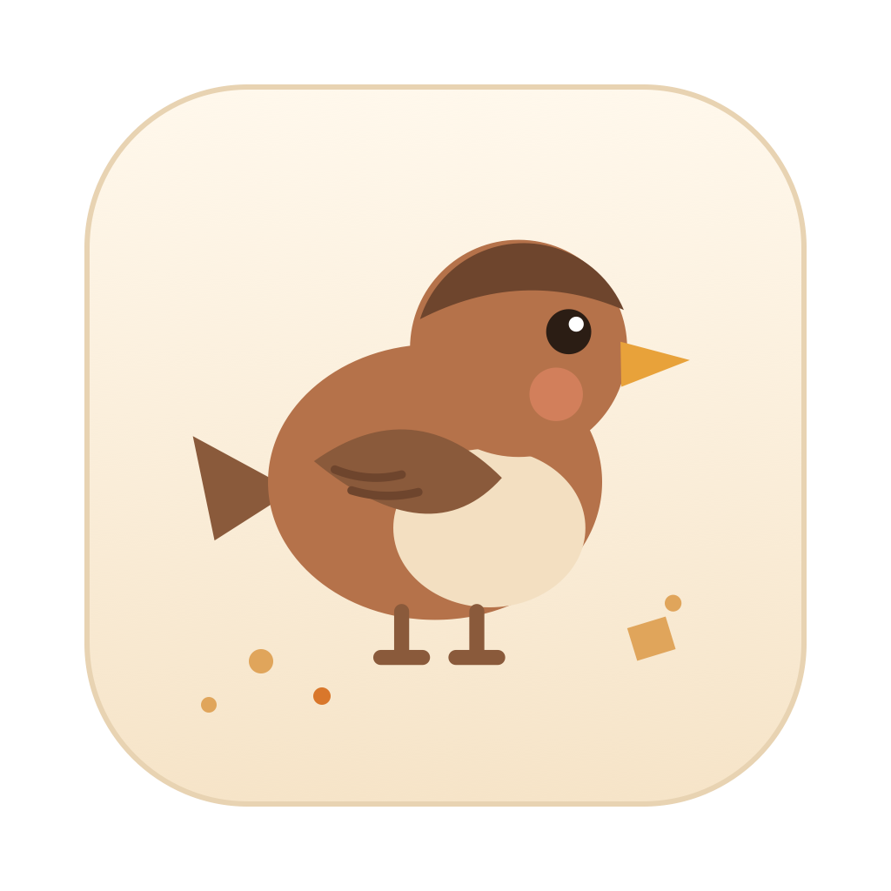
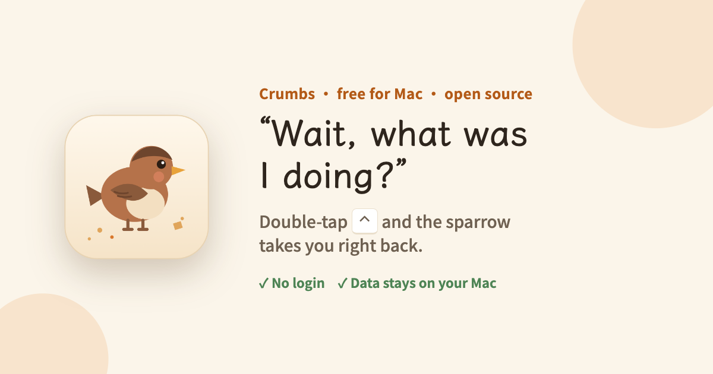
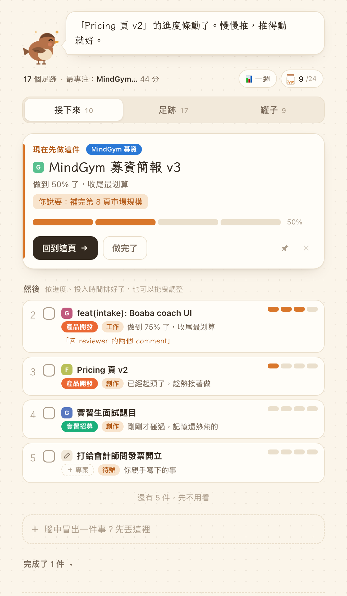
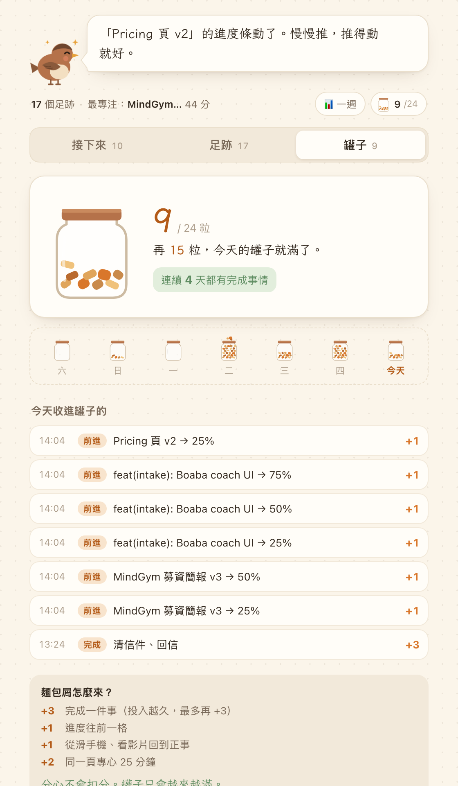
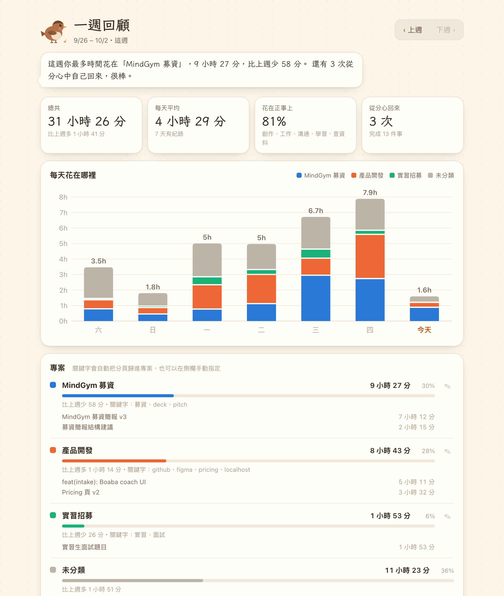

<p align="center">
  
</p>

<h1 align="center">Crumbs 麵包屑</h1>

<p align="center">
  <b>“Wait, what was I doing?”</b><br>
  A little sparrow in your Mac menu bar that remembers every app, window and tab you hop through.<br>
  Double-tap <kbd>⌃</kbd> and it takes you right back.
</p>

<p align="center">
  <a href="https://crumbs.01-crumbs.workers.dev/en/"><b>Download for Mac (free)</b></a> ·
  <a href="https://crumbs.01-crumbs.workers.dev/">中文網站</a> ·
  <a href="#中文說明">中文說明</a>
</p>

<p align="center">
  
</p>

---

## Why

If your brain jumps around (ADHD or not), the hardest part of an interruption isn't the interruption — it's getting back. You come back from a message and the half-written paragraph, the tab you were reading, the thing you meant to fix… are all gone from your head.

Crumbs quietly leaves a trail of breadcrumbs as you work, so you never have to remember.

## What it does

| | |
|---|---|
| **⌃⌃ “What was I doing?”** | Double-tap Control anywhere. A bar slides up: where you just were, how long you stayed, and what you said you'd do there. <kbd>↑</kbd><kbd>↓</kbd> + <kbd>Enter</kbd> jumps back to that exact app, document or browser tab. |
| **Notes to future you** | Start typing in the bar to leave a note for this place (“fix the conclusion”). Crumbs reminds you next time you come back. |
| **“Up next”** | Turns what you touched today into a to-do list and explains *why* one comes first: half-finished, most time spent, keeps coming back. |
| **Weekly review** | Where each day actually went — by app/site, by your own projects, or by kind of work — compared with last week. |
| **The crumb jar** | Finishing things and *coming back from a distraction* earn crumbs. Getting distracted never costs you points. |

**Private by design:** no account, no server. Everything lives in `~/Library/Application Support/Crumbs` on your Mac. Crumbs records app names, window titles, tab URLs/titles and time — never page content, screenshots or keystrokes.

> **Note:** the app UI is currently in Traditional Chinese. An English UI is planned — PRs and issues welcome!

<p align="center">
  
  
</p>
<p align="center">
  
</p>

## Install

1. [Download the DMG](https://crumbs.01-crumbs.workers.dev/en/) (signed with an Apple Developer ID and notarized) and drag Crumbs to Applications.
2. Open it — a sparrow appears in your menu bar.
3. Allow **Accessibility** (System Settings → Privacy & Security → Accessibility) so it can read window titles and listen for ⌃⌃, and click **OK** when macOS asks to let it control your browser (to read the current tab's URL).

Requires macOS 14+ on Apple silicon.

## Build from source

```bash
cd mac
./build.sh                      # → mac/build.noindex/Crumbs 麵包屑.app
open "build.noindex/Crumbs 麵包屑.app"
```

No Xcode project — just `swiftc` (Xcode Command Line Tools). Without a Developer ID certificate it falls back to ad-hoc signing, which means macOS forgets the Accessibility permission on every rebuild.

### Chrome extension

The repo root is also a Manifest V3 Chrome extension (the original version of Crumbs): `chrome://extensions` → Developer mode → **Load unpacked** → select this folder. See [README-extension.zh-TW.md](README-extension.zh-TW.md).

## How it's built

```
shared.js          the brain: URL/title → “what you're doing”, to-do ranking, weekly stats, the jar
                   (pure JS, shared by the Chrome extension and the Mac app)
background.js      Chrome extension service worker
content.js         the peeking sparrow on web pages (Shadow DOM)
sidepanel.*        main UI: up next, trail, jar
dashboard.*        weekly review
mac/Sources/       native Mac app (Swift): menu bar, tracker (Accessibility + AppleScript),
                   ⌃⌃ overlay (SwiftUI), and a WKWebView that runs the same web UI
mac/web/bridge.js  lets the web UI talk to Swift
site/              the website (Cloudflare Workers static assets)
worker/            privacy-friendly page-view counter for the website (no cookies, no IPs)
dev/               mock Chrome API + preview pages for working on the UI in a browser
```

## Contributing

Issues and pull requests are welcome — especially:

- 🌏 English UI / i18n
- 💻 Intel Mac build
- 🧭 better “what are you doing” rules for apps and sites you use (`RULES` in `shared.js`, `mac/Sources/Describe.swift`)

If Crumbs helps you, a ⭐ helps other people find it.

## License

[MIT](LICENSE)

---

## 中文說明

**分心之後，找回你剛剛在做什麼。** Crumbs 麵包屑是一隻住在 Mac 選單列的小麻雀。你在 App、視窗、網頁之間跳來跳去，它一路幫你撿起麵包屑；想不起來剛剛在幹嘛，**連按兩下 <kbd>⌃</kbd>** 就幫你接回去。

- **免費下載**：<https://crumbs.01-crumbs.workers.dev/>（Apple 公證，macOS 14+、Apple 晶片）
- **不用註冊、不用登入**，資料只存在你的 Mac，不讀內容、不截圖、不記錄打字
- **主要功能**：⌃⌃ 叫出「剛剛你在…」並一鍵跳回、替每個地方記筆記、「接下來」待辦排序、一週回顧（每天花在哪）、獎勵「回來」的麵包屑罐
- 自己編譯：`cd mac && ./build.sh`
- Chrome 擴充功能版說明：[README-extension.zh-TW.md](README-extension.zh-TW.md)

有問題或想法歡迎開 issue，或寫信到 yolanda921223@gmail.com。
